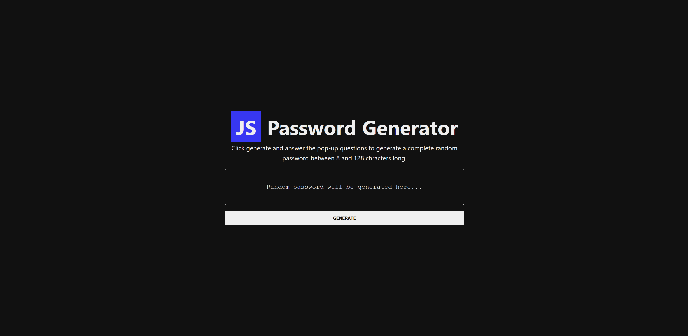
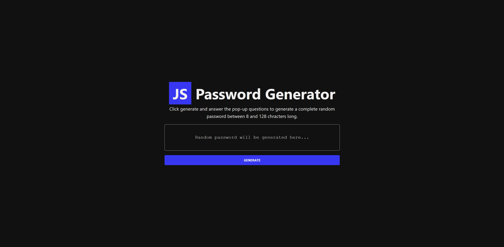
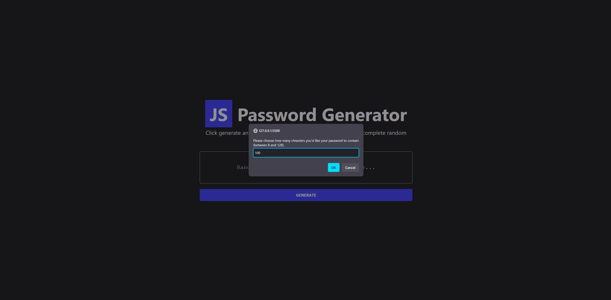
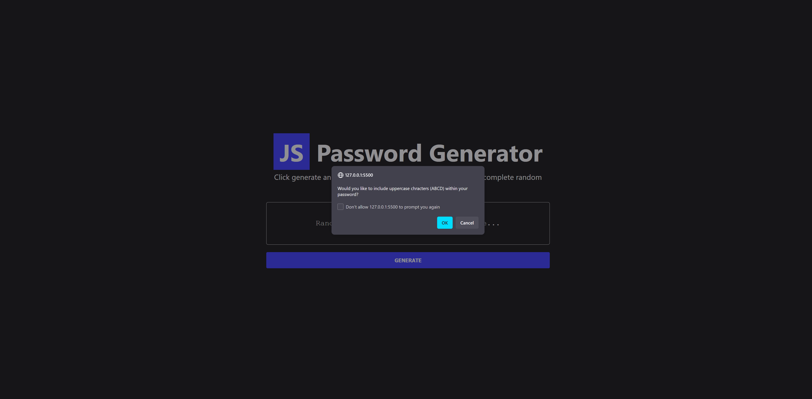
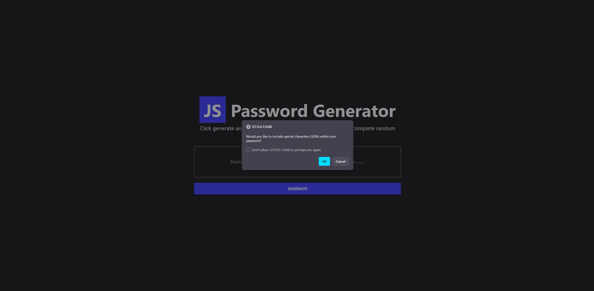
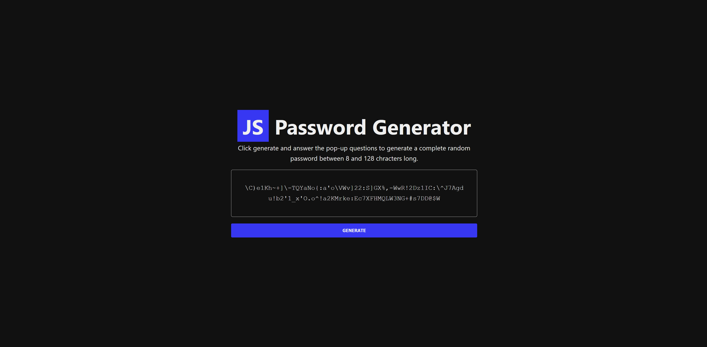
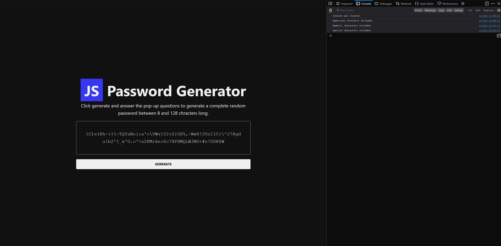
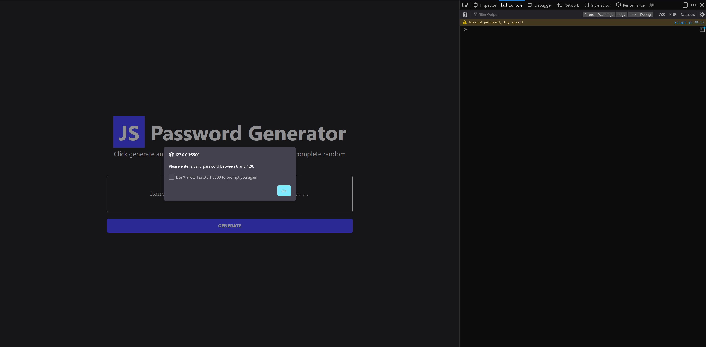

# JavaScript Random Password Generator

## Description

This weeks module challenge marked a big leap forward in JavaScript learning about data structures and their methods as well as diving into functions. In this project, I've created a random password generator to help the user generate a random password. Security in todays world is essential and one thing I see over and over again is people close to me using the same, simple password across multiple accounts.

If there's one thing you can do to protect yourself against malicious people out there is to use a secure password. Passwords that are a lot harder to crack and that have no tie to your personal life! This is where this little project can come in handy for you.

Live demo: https://mvpcurtis.github.io/password-generator/

## Usage

Once you're on the page, click the 'generate' button at the bottom. Multiple pop-ups will show to ask you for you preference in generating a password. An example, an pop-up box will show 'to ask if you'd like to include numbers in your password'. Either press the 'confirm' button if you would or the 'cancel' button if you wouldn't. As simple as that!

## License

MIT License

Copyright (c) 2023 Curtis

Permission is hereby granted, free of charge, to any person obtaining a copy
of this software and associated documentation files (the "Software"), to deal
in the Software without restriction, including without limitation the rights
to use, copy, modify, merge, publish, distribute, sublicense, and/or sell
copies of the Software, and to permit persons to whom the Software is
furnished to do so, subject to the following conditions:

The above copyright notice and this permission notice shall be included in all
copies or substantial portions of the Software.

THE SOFTWARE IS PROVIDED "AS IS", WITHOUT WARRANTY OF ANY KIND, EXPRESS OR
IMPLIED, INCLUDING BUT NOT LIMITED TO THE WARRANTIES OF MERCHANTABILITY,
FITNESS FOR A PARTICULAR PURPOSE AND NONINFRINGEMENT. IN NO EVENT SHALL THE
AUTHORS OR COPYRIGHT HOLDERS BE LIABLE FOR ANY CLAIM, DAMAGES OR OTHER
LIABILITY, WHETHER IN AN ACTION OF CONTRACT, TORT OR OTHERWISE, ARISING FROM,
OUT OF OR IN CONNECTION WITH THE SOFTWARE OR THE USE OR OTHER DEALINGS IN THE
SOFTWARE.
